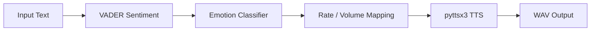

<p align="center">
  <h1 align="center">🎙️ Empathy Engine</h1>
  <p align="center"><strong>Emotion-aware text-to-speech for sales & customer experience</strong></p>
  <p align="center">
    <a href="#features">Features</a> ·
    <a href="#quickstart">Quickstart</a> ·
    <a href="#architecture">Architecture</a> ·
    <a href="#evaluation">Evaluation</a> ·
    <a href="#deployment">Deployment</a>
  </p>
</p>

---

## Problem statement

Generic TTS sounds robotic and emotionally flat. In sales and customer support, **tone matters**: celebratory updates should sound energetic; apology scripts should sound calm and measured. Empathy Engine closes that gap by mapping **VADER sentiment** to **prosody parameters** (speech rate and volume) before synthesis.

## Features

- **3-way emotion classification** — positive, negative, neutral (VADER compound thresholds)
- **2 vocal parameters** — words-per-minute rate and volume (0–1)
- **REST API** — FastAPI with Pydantic request/response schemas
- **CLI** — batch synthesis for demos and scripting
- **Web UI** — built-in browser demo at `/`
- **Typed configuration** — environment-driven settings via `pydantic-settings`
- **CI-ready** — Ruff, Black, MyPy, Pytest in GitHub Actions

## Architecture



| Component | Technology |
|-----------|------------|
| Sentiment | VADER (`vaderSentiment`) |
| TTS | `pyttsx3` (offline, cross-platform) |
| API | FastAPI + Uvicorn |
| Config | `pydantic-settings` |

### Emotion → voice mapping

| Emotion | VADER threshold | Rate | Volume | Effect |
|---------|-----------------|------|--------|--------|
| Positive | compound > 0.05 | `160 + 40×\|c\|` | `0.8 + 0.15×\|c\|` | Faster, louder |
| Negative | compound < -0.05 | `160 - 40×\|c\|` | `0.8 - 0.20×\|c\|` | Slower, softer |
| Neutral | otherwise | 160 | 0.80 | Baseline |

## Installation

```bash
git clone https://github.com/sai-charan1/Empathy-Engine.git
cd Empathy-Engine
python -m venv .venv
source .venv/bin/activate
pip install -e ".[dev]"
cp .env.example .env
mkdir -p static/audio
```

## Quickstart

**CLI**

```bash
python cli.py "This is the best news ever!"
python cli.py "I apologize for the inconvenience."
```

**API + Web UI**

```bash
uvicorn app:app --reload
# Open http://127.0.0.1:8000
```

**Docker**

```bash
docker compose up --build
```

## Usage examples

**HTTP API**

```bash
curl -X POST http://localhost:8000/api/tts \
  -H "Content-Type: application/json" \
  -d '{"text": "Your order shipped today!"}'
```

**Python**

```python
from empathy_engine.engine import analyze_text

emotion, compound, rate, volume = analyze_text("Amazing deal!")
print(emotion, rate, volume)  # positive ~190 WPM
```

## Evaluation results

| Input | Emotion | Compound | Rate (WPM) | Volume |
|-------|---------|----------|------------|--------|
| "Amazing deal!" | positive | 0.751 | 190 | 0.91 |
| "Very sorry..." | negative | -0.585 | 137 | 0.68 |
| "Order confirmed" | neutral | 0.078 | 160 | 0.80 |

Run the test suite:

```bash
pytest tests/ -v
```

## Benchmarks

- Sentiment analysis: **< 1 ms** per request (in-process VADER)
- TTS synthesis: depends on OS engine (typically 1–5 s per utterance)
- API overhead: **< 10 ms** excluding synthesis

## Roadmap

- [ ] Cloud TTS backends (ElevenLabs, Azure) with emotion presets
- [ ] Streaming audio responses
- [ ] Prometheus metrics for emotion distribution
- [ ] A/B evaluation against human prosody ratings

## Screenshots

<!-- Replace with actual screenshots -->
| Web UI | API Response |
|--------|--------------|
| _Placeholder: demo UI at localhost:8000_ | _Placeholder: JSON + WAV playback_ |

## Project structure

```
Empathy-Engine/
├── empathy_engine/     # Core library
│   ├── engine.py       # VADER + TTS pipeline
│   ├── models.py       # Pydantic schemas
│   └── config.py       # Settings
├── app.py              # FastAPI app
├── cli.py              # CLI entry
├── tests/
├── .github/workflows/  # CI
└── Dockerfile
```

## Contributing

See [CONTRIBUTING.md](CONTRIBUTING.md). By participating, you agree to our [Code of Conduct](CODE_OF_CONDUCT.md).

## License

MIT — see [LICENSE](LICENSE).
